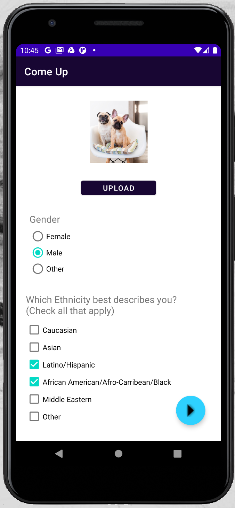
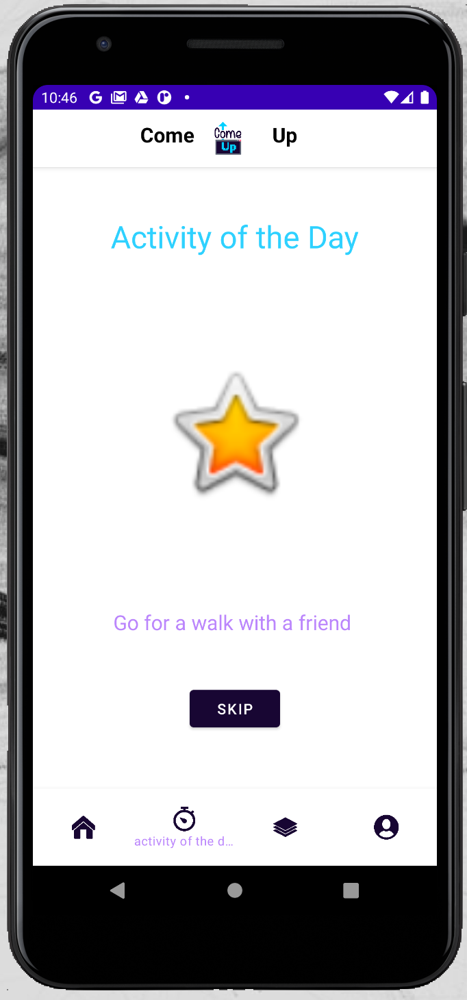
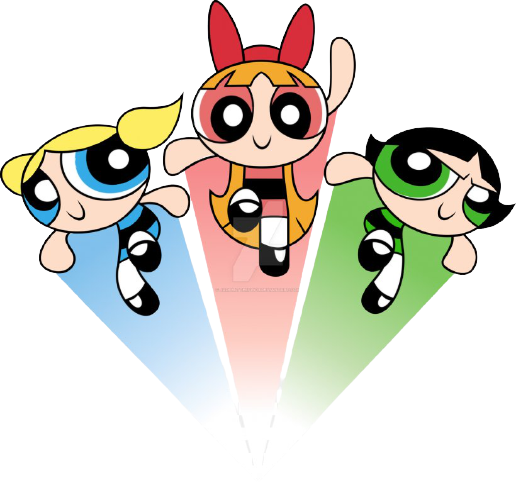

# Powerpuff-Girls
2020 Hackathon

Our team chose to tackle the problem of diversity in STEM by focusing on the subproblem of lack of access to resources.

#### As students we always hear about all the scholarships and clubs that are available to help us succeed academically and professionally. The challenge is actually finding the opportunities that are relevant to us. 

## ComeUp is an app to help connect students to resources such as scholarships and events.

It serves students of all ages and degree levels. 

Users create a profile based on their demographics and can filter through the resources based on certain factors. 

ComeUp allows users to access all resources as well as filtered views, offering the best experience and chance for success to it's users. 

Many students are struggling with online school and are lacking motivation and things to do. ComeUp helps by offering an activity of the day to increase mental and physical health during these challenging times. 

For a full tour of the app and project please click [here to watch a YouTube video.](https://www.youtube.com/watch?v=qCztRDDIYrQ&feature=youtu.be&ab_channel=CandyNwigwe)

Coded by the Powerpuff Girls Team
Special thanks to Kailee-Anne Pilling for the logo

